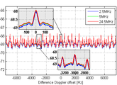

`magnifyOnFigure` Matlab function. Allow to plot a zoomed graph inside of the currrent one.

# History

Powerful on-figure magnifier, suitable for the publication of compact graphical results created [fisrt publish](https://www.mathworks.com/matlabcentral/fileexchange/26007-on-figure-magnifier) by [David Fernandez-Prim](https://www.mathworks.com/matlabcentral/profile/authors/1940299-david-fernandez-prim).

Fix some old Matlab version behaviours, allow to use in any axis (the last one active) and fix the behaviour in log graph by [Hildo Guillardi Júnior](https://www.mathworks.com/matlabcentral/profile/authors/3318785-hildo).

Kept the original license of the author.

# Usage

Editor's Note: This file was selected as MATLAB Central Pick of the Week

This utility provides a powerful zooming tool specially designed for the documentation of original and zoomed 2D graphics of images on the same plot.

It is composed of two blocks (the secondary axes and the magnifier). The secondary axes, which can be arbitrarily allocated within the limits of the figure, displays the area marked by the magnifier.

The highly versatile interface of the 'on-figure magnifier' offers a world of possibilities in a broad range of applications and fields. The Keyboard/mouse or programmatic configuration of this tool allows the user to set her or his own graphic style, to suit the requirements of any publication's editor. More details on interfacing and properties can be found in the .m file.

EXAMPLE: (for usage examples, run 'magnifyOnFigure_examples.m')

PROPERTIES:

'secondaryAxesFaceColor': ColorSpec.

'edgeWidth' Color of the box surrounding the secondary axes, magnifier and link. Default 1.

'edgeColor': Color of the box surrounding the secondary axes, magnifier and link. Default 'black'.

'displayLinkStyle': Style of the link. 'none', 'straight' or 'edges', with 'straight' as default.

'mode': 'manual' or 'interactive' (allowing adjustments through mouse/keyboard). Default 'interactive'.

'units' Units in which the position vectors are given. Only 'pixels' currently supported

'initialPositionSecondaryAxes': Initial position vector ([left bottom width height]) of secondary axes, in pixels

'initialPositionMagnifier': Initial position vector ([left bottom width height]) of magnifier, in pixels

'secondaryAxesXLim': Initial XLim value of the secondary axes

'secondaryAxesYLim': Initial YLim value of the secondary axes

HOT KEYS (active if 'mode' set to 'interactive')

-In a figure with multiple magnigier instances

'Tab': Switch the focus from one magnifier instance to the next one on the current figure.

'Mouse pointer on secondary axes or magnifier of a tool+double left click' Regain focus

-On the focused magnifier instance

'up arrow': Moves magnifier 1 pixel upwards

'down arrow': Moves magnifier 1 pixel downwards

'left arrow': Moves magnifier 1 pixel to the left

'right arrow': Moves magnifier 1 pixel to the right

'Shift+up arrow': Expands magnifier 10% on the Y-axis

'Shift+down arrow': Compress magnifier 10% on the -axis

'Shift+left arrow': Compress magnifier 10% on the X-axis

'Shift+right arrow': Expands magnifier 10% on the X-axis

'Control+up arrow': Moves secondary axes 1 pixel upwards

'Control+down arrow': Moves secondary axes 1 pixel downwards

'Control+left arrow': Moves secondary axes 1 pixel to the left

'Control+right arrow': Moves secondary axes 1 pixel to the right

'Alt+up arrow': Expands secondary axes 10% on the Y-axis

'Alt+down arrow': Compress secondary axes 10% on the Y-axis

'Alt+left arrow': Compress secondary axes 10% on the X-axis

'Alt+right arrow': Expands secondary axes 10% on the X-axis

'PageUp': Increase additional zooming factor on X-axis

'PageDown': Decrease additional zooming factor on X-axis

'Shift+PageUp': Increase additional zooming factor on Y-axis

'Shift+PageDown': Decrease additional zooming factor on Y-axis

'Shift+Q': Resets the additional zooming factors to 0

'Control+A': Displays position of secondary axes and magnifier in the command window

'Control+D': Deletes the focused tool

'Mouse pointer on magnifier+left click' Drag magnifier to any direction

'Mouse pointer on secondary axes+left click' Drag secondary axes in any direction

